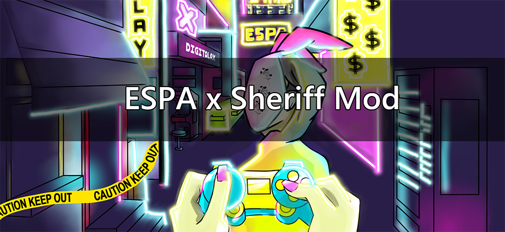

# ESPA-Sheriff-Mod

</img>

<h3>What does the Sheriff do?</h3>
The Sheriff is able to kill Impostors. If they shoot a Crewmate, they will lose their life instead.
<h3>What is ESPA?</h3>
ESPA is the first ever dedicated Esports platform for independent developers, modders, designers and casual players or gamers.
With this mod you are able to participate for Among Us tournaments on ESPA where players can receive prices. Play the OG Sheriff mod with new ingame outfits with other ESPA players.
Check out the website <a href="https://espa.digitalax.xyz/">https://espa.digitalax.xyz/</a> and the <a href="https://discord.com/invite/QM6CktUsKw">ESPA Discord</a>.

<h2 id="installation"> Installation </h2>
<ul>
<li>Download the Mod for your specific game version. You are not able to launch the game if the versions do not match.</li>
<li>Make a copy of your game’s root directory (Steam/steamapps/common/Among Us) and rename it to whatever you want (Steam/steamapps/common/Among Us ESPA Sheriff Mod) </li>
<li>Extract the content of Among Us ESPA Sheriff Mod.zip into the copied folder you created and accept the replacement</li>
<li>Open your modded folder and open the Game via Among Us.exe</li>
</ul>

Verifying installation success

<ul>
  <li>Launch the Game via Among Us.exe.
  <li>In the top-left corner, below Among Us version, you should see <em>> Digitalax < Outfit Collection vx.y</em> and <em>loaded Sheriff Mod vx.y by Woodi </em>
</ul>

If you don't see this message please take a look at our 
  <a href="#troubleshooting">troubleshooting section</a>.

 
<h2>Releases and Compatibility</h2>
 
 <table style="width:100%">
  <tr>
    <th>Among Us Version</th>
    <th>Mod Version</th>
    <th>Link</th>
      </tr>
        <tr>
    <td>v2021.4.14s</td>
    <td>v1.23</td>
    <td><a href="https://github.com/Woodi-dev/ESPA-Sheriff-Mod/releases/download/v1.23_2021.4.14s/Among.Us.ESPA.Sherif.fv1.23.v2021.4.14s.zip">Download</></td>

</table>

  
Changelog

<h2>Q&A</h2>
 

<b>How do I join ESPA?</b> 
Check out the website <a href="https://espa.digitalax.xyz/">https://espa.digitalax.xyz/</a> and join the <a href="https://discord.com/invite/QM6CktUsKw">ESPA Discord</a>. There upcoming tournaments will be announced. Select server region Digitalax to play on ESPA.

<b>How do i get new outfits?</b> 
New outfits designed by Kodomadachi and Charli Cohen are added directly into the game as NFTs. You can buy / earn these outfits on the Digitalax marcetplace.
It is required to play on Digitalax servers to use the new ESPA collection.

<b>Why are there no vanilla outfits?</b> 
Vanilla skins and hats are locked at the moment and may be activated again in the future. We replaced many cosmetics by the ESPA ones.

<h2>Donate</h2>

<a href="https://www.paypal.com/donate?hosted_button_id=TWGK7A9VBVPRU"></img></a>

I would appreciate any donations. This will help me to develop more mods.

For exclusive modding requests contact me: <a href="mailto:Woodi-dev@gmx.de">Woodi-dev@gmx.de</a>

<h2 id="troubleshooting">Troubleshooting</h2>

<b>I can't see <em>loaded</em> message on my game screen</b> 
<ol>
  <li>Make sure you have followed all the <a href="#installation">installation steps</a>, especially launching the game via the Among Us.exe file</li>
  <li>You might be missing some cpp libs (software libraries used by the mod); please install 
    <a href="https://aka.ms/vs/16/release/vc_redist.x86.exe">visual studio c++</a>
  </li>
</ol>

<b>I can't find my issue.</b> 
You can <a href="https://github.com/Woodi-dev/Among-Us-Sheriff-Mod/issues/new">raise an issue within GitHub</a> documenting your issue. You will need to be logged into GitHub to do this.

<h2>License</h2>
<a href="https://github.com/BepInEx/BepInEx">BepinEx</a> is distributed under <b>LGPL-2.1</b> License.

